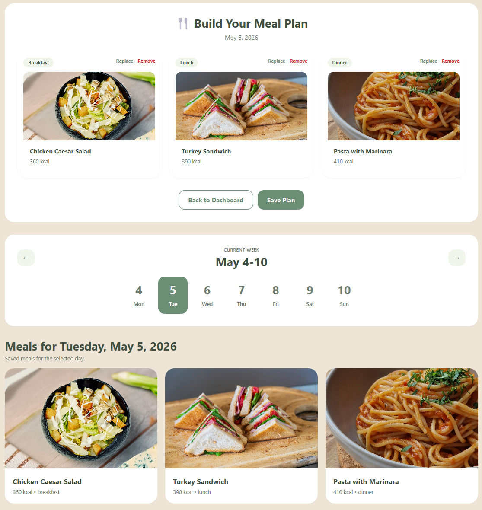
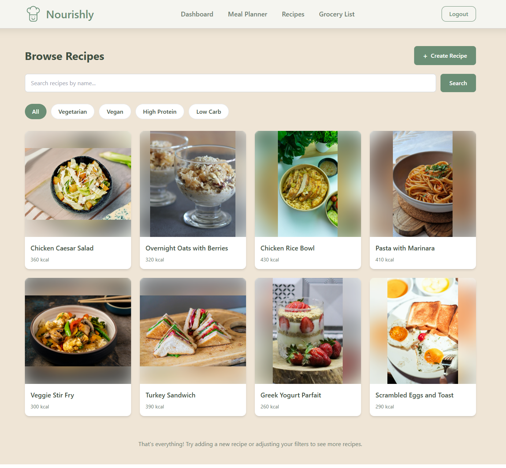
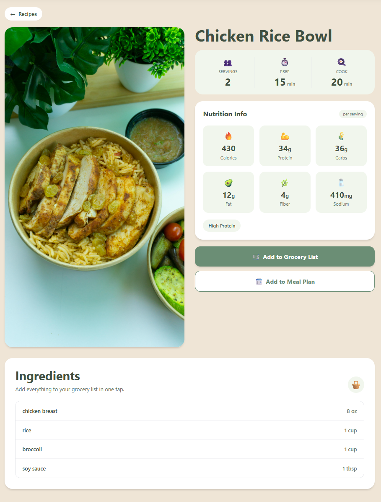
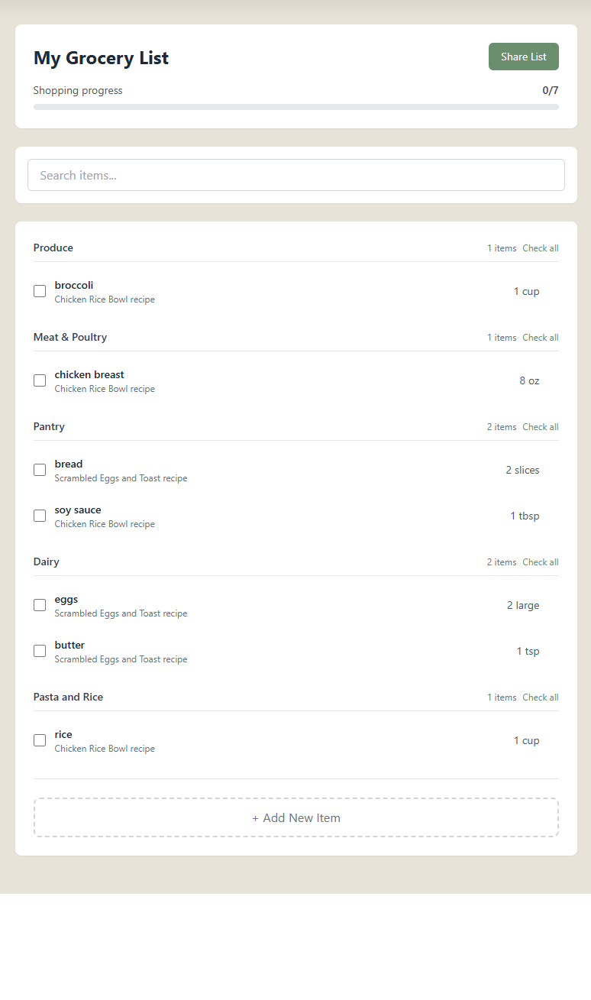

# Nourishly

Nourishly is a meal-planning web app for people who want an easier way to organize meals, discover recipes, and turn plans into a grocery list they can actually use.

[Try the live app](https://main.d2hvbdc7xxhqmv.amplifyapp.com/) | [View the repository](https://github.com/cs041-mealplanner/CS041-meal-planning-app)

## Why Nourishly

Planning meals for the week can be repetitive, easy to forget, and frustrating when recipes, ingredients, and shopping lists all live in different places. Nourishly brings those steps together so users can go from "what should I make?" to a ready-to-shop list in one flow.

## What You Can Do

- Plan breakfast, lunch, and dinner for each day of the week.
- Browse recipes by name and filter by tags like `Vegetarian`, `Vegan`, `High Protein`, and `Low Carb`.
- Create custom recipes with ingredients, nutrition details, and tags.
- Add recipe ingredients directly to a grocery list.
- Track grocery progress with categorized items and checkboxes as you shop.
- Use the dashboard to quickly review today's meals, this week's plan, and grocery progress.

## Current Highlights

### Weekly Meal Planner

Build a weekly plan one day at a time, choose meals for breakfast, lunch, and dinner, and save the plan for later.

### Recipe Discovery and Custom Recipes

Search for recipes, browse filtered results, and add your own recipes when you want something more personal than the default pool.

### Grocery List Workflow

Turn ingredients from a recipe into a grocery list, organize items by category, and check them off while shopping.

### Dashboard Overview

See today's meals, a weekly calendar snapshot, and grocery list progress from one central page.

## How To Access It

Use the live deployment here:

[https://main.d2hvbdc7xxhqmv.amplifyapp.com/](https://main.d2hvbdc7xxhqmv.amplifyapp.com/)

To explore the app locally:

1. Clone the repository.
2. Install dependencies with `npm ci` in `client/`.
3. Run `npm run dev:client` from the repository root.
4. Open `http://localhost:5173`.

### Requirements

- Node.js 20.x
- Git

## Screenshots


*Plan meals for the week in one place.*


*Browse recipe options and narrow results by preference.*


*Review recipe details and add ingredients directly to your grocery list.*


*Stay organized while shopping with grouped items and progress tracking.*

## Team

- Che-Han Hsu
- Lapatrada Liawpairoj
- Kyle Lund
- Xander Sniffen
- Louie Baobao

Project partner: Alexander Ulbrich

## Contact and Feedback

- Open an issue on GitHub: [Project Issues](https://github.com/cs041-mealplanner/CS041-meal-planning-app/issues)
- Team contact email: [alexander.ulbrich@oregonstate.edu](mailto:alexander.ulbrich@oregonstate.edu)

## Development Notes

### Tech Stack

- React + Vite
- AWS Amplify
- Tailwind CSS

### Commands

Run the client locally:

```bash
npm run dev:client
```

Run linting:

```bash
npm run lint
```

Run tests:

```bash
npm run test:client
```

Build the client:

```bash
npm run build:client
```

## Design Reference

Design prototypes and wireframes are maintained in Figma:

[Meal Planner Web App Figma](https://www.figma.com/design/AaskoDRw7IUEmEOyLcIDQa/Meal-Planner-Web-App)

Designer: Lapatrada Liawpairoj

## License

MIT License Copyright (c) 2025 Team CS.041 - Oregon State University
